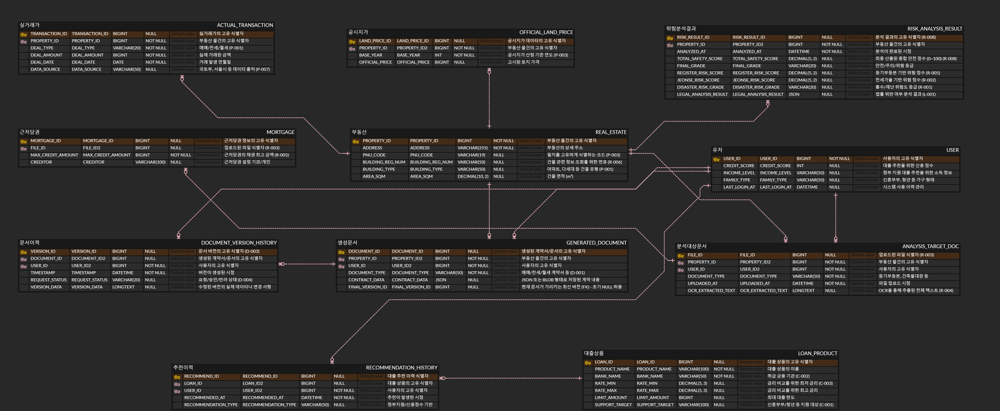

# 집을 현명하게 전세매매하자, ZIPHYEONJEON

[//]: # (추후 필요시 주석 사용)

> 2026년 국토·교통 데이터 활용 경진대회에 출품한 부동산 데이터 분석 시스템입니다.

## 담당 역할 
- 프로젝트 협업 관리
- 백엔드 관련 배포 (AWS RDS, Render)
- 상가 관련 기능 백엔드 및 AI 개발

---

## 트러블 슈팅 및 문제 해결

### 최적화 - 공공데이터 API 연동

🔗 [공공데이터 API 연동 최적화 과정](https://jih00njung.github.io/posts/%EA%B3%B5%EA%B3%B5%EB%8D%B0%EC%9D%B4%ED%84%B0-API-%EC%97%B0%EB%8F%99-%EA%B0%9C%EC%84%A0-%EA%B3%BC%EC%A0%95/)

- **문제**
    - write
- **해결**
    - write
- **결과**
    - write

---

## 기술 스택

- **Backend**: Java 21, Spring Boot 3.5.14, Spring Data JPA
- **Database**: MySQL 8.0
- **AI**: LightGBM
- **Tools**: AWS RDS,  Render,  Swagger, Gradle

---

## ERD

[집현전v1 기획서](https://docs.google.com/document/d/1bCCsgrb89_NNAsgIdyxNmWSde2p8IGRJ9R9z1lWfNKw/edit?tab=t.0)

[집현전v1 요구사항명세서](https://docs.google.com/spreadsheets/d/1HqyhI8r0kijz5Ojh_eGcRx_WpLbFMKFiXK4tbgisGqM/edit?gid=440390789#gid=440390789)